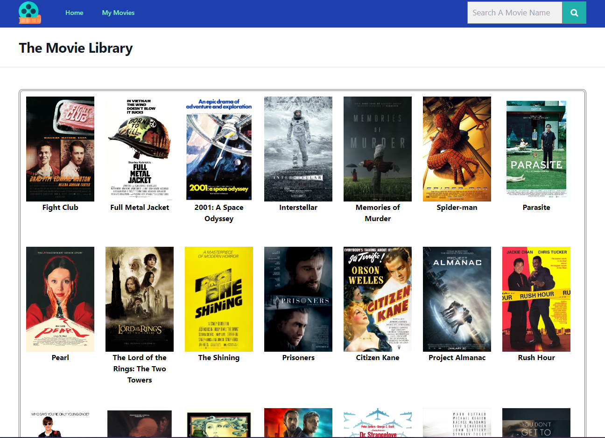

# The Movie Library  - API Project

## **Description**

TEXT

---

## **Project Requirements**
```
* Use a CSS framework other than Bootstrap.

* Be deployed to GitHub Pages.

* Be interactive (i.e., accept and respond to user input).

* Use at least two [server-side APIs](https://coding-boot-camp.github.io/full-stack/apis/api-resources).

* Does not use alerts, confirms, or prompts (use modals).

* Use client-side storage to store persistent data.

* Be responsive.

* Have a polished UI.

* Have a clean repository that meets quality coding standards (file structure, naming conventions, follows best practices for class/id naming conventions, indentation, quality comments, etc.).

* Have a quality README (with unique name, description, technologies used, screenshot, and link to deployed application).
```
---

## **Preview**


---

## **Usage & Live Link**

To view/use this project, it can be accessed by going to []().

---

## **Credits**

- 

---